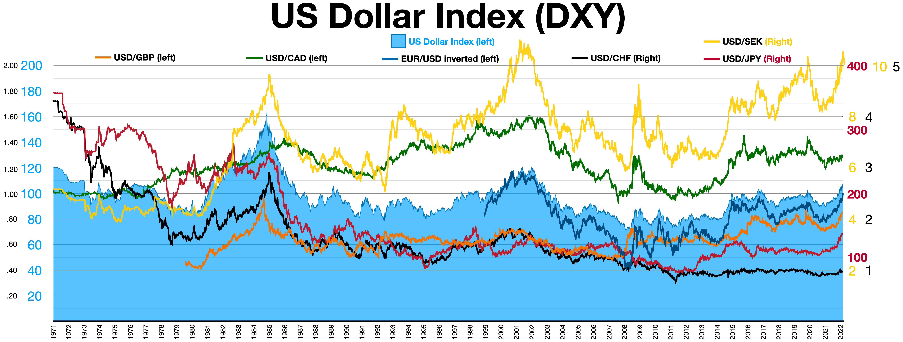

> 🏦 En 1985, cinco de las mayores economías del mundo firmaron un acuerdo que cambiaría el rumbo del sistema financiero internacional. Los Acuerdos Plaza marcaron un antes y un después en la gestión de los tipos de cambio y la hegemonía del dólar.

---

## 🌍 Contexto histórico

A principios de los años 80, el mundo atravesaba importantes desequilibrios económicos:
- El dólar estadounidense estaba extremadamente fuerte frente a otras monedas principales (yen japonés, marco alemán, franco francés, libra esterlina).
- Este superdólar perjudicaba las exportaciones estadounidenses y generaba tensiones comerciales, especialmente con Japón y Europa.
- El déficit comercial y fiscal de EE.UU. alcanzaba niveles récord, mientras que otras economías sufrían por la competencia desleal.

---

## 🤝 ¿Qué fueron los Acuerdos Plaza?

El **Acuerdo Plaza** fue un pacto firmado el 22 de septiembre de 1985 en el hotel Plaza de Nueva York por los ministros de finanzas y gobernadores de los bancos centrales del G5: Estados Unidos, Japón, Alemania Occidental, Francia y Reino Unido.

El objetivo principal era coordinar una depreciación controlada del dólar para corregir los desequilibrios globales y reducir el déficit comercial estadounidense.

---

## 📝 Principales puntos del acuerdo

- Intervención coordinada en los mercados de divisas para vender dólares y comprar otras monedas.
- Comunicación conjunta para influir en las expectativas del mercado.
- Compromiso de los países de ajustar sus políticas económicas para facilitar el reequilibrio global.

---

## 💡 ¿Por qué fue tan relevante?

- Marcó una inusual cooperación internacional en política monetaria y cambiaria.
- Demostró el poder de la "intervención verbal" y la coordinación para influir en los mercados.
- Dio origen a una depreciación significativa del dólar (más del 40% frente al yen y el marco en dos años).
- Sentó las bases para futuros acuerdos multilaterales, como el Acuerdo del Louvre (1987).

---

## 📉 Consecuencias y efectos

- **Para EE.UU.:** Mejoró la competitividad de las exportaciones, pero también generó presiones inflacionarias y un aumento de las tasas de interés.
- **Para Japón:** El yen se apreció fuertemente, lo que contribuyó a la burbuja financiera y de activos de finales de los 80.
- **Para Europa:** El marco alemán se fortaleció, modificando los equilibrios dentro del Sistema Monetario Europeo.
- **Mercados globales:** El acuerdo mostró que la cooperación internacional podía tener efectos inmediatos y profundos en los mercados financieros.

---

## 🏛️ Debates y legado

- **¿Éxito o parche temporal?** Algunos consideran que los Acuerdos Plaza resolvieron desequilibrios inmediatos, pero no las causas estructurales.
- **Cooperación vs. soberanía:** El pacto mostró el potencial y los límites de la coordinación internacional.
- **Lecciones para hoy:** En un mundo globalizado, la cooperación sigue siendo clave, pero también difícil de sostener.

---

> 💬 Los Acuerdos Plaza fueron un experimento único de cooperación internacional que dejó huellas profundas en la economía mundial y en la historia de las políticas cambiarias.
